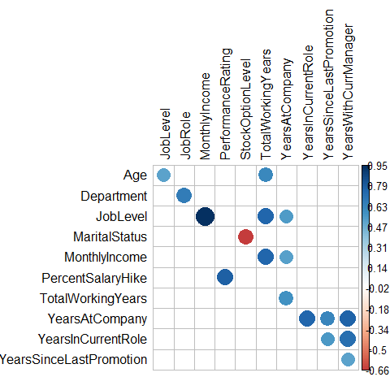

code
================
Aremu oluwasegun
2024-01-18

## Loading Required Libraries and dataset.

``` r
library(dplyr)
```

    ## Warning: package 'dplyr' was built under R version 4.2.3

    ## 
    ## Attaching package: 'dplyr'

    ## The following objects are masked from 'package:stats':
    ## 
    ##     filter, lag

    ## The following objects are masked from 'package:base':
    ## 
    ##     intersect, setdiff, setequal, union

``` r
library(ggplot2)
```

    ## Warning: package 'ggplot2' was built under R version 4.2.1

``` r
library(readr)
```

    ## Warning: package 'readr' was built under R version 4.2.1

``` r
library(reshape2)
```

    ## Warning: package 'reshape2' was built under R version 4.2.3

``` r
library(corrplot)
```

    ## Warning: package 'corrplot' was built under R version 4.2.3

    ## corrplot 0.92 loaded

``` r
Employee_Attrition <- read_csv("C:/Data analysis/Projects Notebook amd markdowns/Hands-on project/Datasets/HR-Employee-Attrition.csv")
```

    ## Rows: 1470 Columns: 35

    ## ── Column specification ────────────────────────────────────────────────────────
    ## Delimiter: ","
    ## chr  (9): Attrition, BusinessTravel, Department, EducationField, Gender, Job...
    ## dbl (26): Age, DailyRate, DistanceFromHome, Education, EmployeeCount, Employ...
    ## 
    ## ℹ Use `spec()` to retrieve the full column specification for this data.
    ## ℹ Specify the column types or set `show_col_types = FALSE` to quiet this message.

## Data Cleaning

### Checking forRedundant Columns and deleting them if Any.

``` r
# Checking for reduncant columns
colnames(Employee_Attrition)
```

    ##  [1] "Age"                      "Attrition"               
    ##  [3] "BusinessTravel"           "DailyRate"               
    ##  [5] "Department"               "DistanceFromHome"        
    ##  [7] "Education"                "EducationField"          
    ##  [9] "EmployeeCount"            "EmployeeNumber"          
    ## [11] "EnvironmentSatisfaction"  "Gender"                  
    ## [13] "HourlyRate"               "JobInvolvement"          
    ## [15] "JobLevel"                 "JobRole"                 
    ## [17] "JobSatisfaction"          "MaritalStatus"           
    ## [19] "MonthlyIncome"            "MonthlyRate"             
    ## [21] "NumCompaniesWorked"       "Over18"                  
    ## [23] "OverTime"                 "PercentSalaryHike"       
    ## [25] "PerformanceRating"        "RelationshipSatisfaction"
    ## [27] "StandardHours"            "StockOptionLevel"        
    ## [29] "TotalWorkingYears"        "TrainingTimesLastYear"   
    ## [31] "WorkLifeBalance"          "YearsAtCompany"          
    ## [33] "YearsInCurrentRole"       "YearsSinceLastPromotion" 
    ## [35] "YearsWithCurrManager"

There are no redundant columns or duplicates \## Removing NaN from the
data

``` r
## Checking if there are null values
summary(Employee_Attrition)
```

    ##       Age         Attrition         BusinessTravel       DailyRate     
    ##  Min.   :18.00   Length:1470        Length:1470        Min.   : 102.0  
    ##  1st Qu.:30.00   Class :character   Class :character   1st Qu.: 465.0  
    ##  Median :36.00   Mode  :character   Mode  :character   Median : 802.0  
    ##  Mean   :36.92                                         Mean   : 802.5  
    ##  3rd Qu.:43.00                                         3rd Qu.:1157.0  
    ##  Max.   :60.00                                         Max.   :1499.0  
    ##   Department        DistanceFromHome   Education     EducationField    
    ##  Length:1470        Min.   : 1.000   Min.   :1.000   Length:1470       
    ##  Class :character   1st Qu.: 2.000   1st Qu.:2.000   Class :character  
    ##  Mode  :character   Median : 7.000   Median :3.000   Mode  :character  
    ##                     Mean   : 9.193   Mean   :2.913                     
    ##                     3rd Qu.:14.000   3rd Qu.:4.000                     
    ##                     Max.   :29.000   Max.   :5.000                     
    ##  EmployeeCount EmployeeNumber   EnvironmentSatisfaction    Gender         
    ##  Min.   :1     Min.   :   1.0   Min.   :1.000           Length:1470       
    ##  1st Qu.:1     1st Qu.: 491.2   1st Qu.:2.000           Class :character  
    ##  Median :1     Median :1020.5   Median :3.000           Mode  :character  
    ##  Mean   :1     Mean   :1024.9   Mean   :2.722                             
    ##  3rd Qu.:1     3rd Qu.:1555.8   3rd Qu.:4.000                             
    ##  Max.   :1     Max.   :2068.0   Max.   :4.000                             
    ##    HourlyRate     JobInvolvement    JobLevel       JobRole         
    ##  Min.   : 30.00   Min.   :1.00   Min.   :1.000   Length:1470       
    ##  1st Qu.: 48.00   1st Qu.:2.00   1st Qu.:1.000   Class :character  
    ##  Median : 66.00   Median :3.00   Median :2.000   Mode  :character  
    ##  Mean   : 65.89   Mean   :2.73   Mean   :2.064                     
    ##  3rd Qu.: 83.75   3rd Qu.:3.00   3rd Qu.:3.000                     
    ##  Max.   :100.00   Max.   :4.00   Max.   :5.000                     
    ##  JobSatisfaction MaritalStatus      MonthlyIncome    MonthlyRate   
    ##  Min.   :1.000   Length:1470        Min.   : 1009   Min.   : 2094  
    ##  1st Qu.:2.000   Class :character   1st Qu.: 2911   1st Qu.: 8047  
    ##  Median :3.000   Mode  :character   Median : 4919   Median :14236  
    ##  Mean   :2.729                      Mean   : 6503   Mean   :14313  
    ##  3rd Qu.:4.000                      3rd Qu.: 8379   3rd Qu.:20462  
    ##  Max.   :4.000                      Max.   :19999   Max.   :26999  
    ##  NumCompaniesWorked    Over18            OverTime         PercentSalaryHike
    ##  Min.   :0.000      Length:1470        Length:1470        Min.   :11.00    
    ##  1st Qu.:1.000      Class :character   Class :character   1st Qu.:12.00    
    ##  Median :2.000      Mode  :character   Mode  :character   Median :14.00    
    ##  Mean   :2.693                                            Mean   :15.21    
    ##  3rd Qu.:4.000                                            3rd Qu.:18.00    
    ##  Max.   :9.000                                            Max.   :25.00    
    ##  PerformanceRating RelationshipSatisfaction StandardHours StockOptionLevel
    ##  Min.   :3.000     Min.   :1.000            Min.   :80    Min.   :0.0000  
    ##  1st Qu.:3.000     1st Qu.:2.000            1st Qu.:80    1st Qu.:0.0000  
    ##  Median :3.000     Median :3.000            Median :80    Median :1.0000  
    ##  Mean   :3.154     Mean   :2.712            Mean   :80    Mean   :0.7939  
    ##  3rd Qu.:3.000     3rd Qu.:4.000            3rd Qu.:80    3rd Qu.:1.0000  
    ##  Max.   :4.000     Max.   :4.000            Max.   :80    Max.   :3.0000  
    ##  TotalWorkingYears TrainingTimesLastYear WorkLifeBalance YearsAtCompany  
    ##  Min.   : 0.00     Min.   :0.000         Min.   :1.000   Min.   : 0.000  
    ##  1st Qu.: 6.00     1st Qu.:2.000         1st Qu.:2.000   1st Qu.: 3.000  
    ##  Median :10.00     Median :3.000         Median :3.000   Median : 5.000  
    ##  Mean   :11.28     Mean   :2.799         Mean   :2.761   Mean   : 7.008  
    ##  3rd Qu.:15.00     3rd Qu.:3.000         3rd Qu.:3.000   3rd Qu.: 9.000  
    ##  Max.   :40.00     Max.   :6.000         Max.   :4.000   Max.   :40.000  
    ##  YearsInCurrentRole YearsSinceLastPromotion YearsWithCurrManager
    ##  Min.   : 0.000     Min.   : 0.000          Min.   : 0.000      
    ##  1st Qu.: 2.000     1st Qu.: 0.000          1st Qu.: 2.000      
    ##  Median : 3.000     Median : 1.000          Median : 3.000      
    ##  Mean   : 4.229     Mean   : 2.188          Mean   : 4.123      
    ##  3rd Qu.: 7.000     3rd Qu.: 3.000          3rd Qu.: 7.000      
    ##  Max.   :18.000     Max.   :15.000          Max.   :17.000

There are no null Values.

## Transformations.

``` r
## Changing some Categorical variables from numeric to character datatype
## Environmental Satisfaction
Employee_Attrition <- Employee_Attrition%>%
  mutate(EnvironmentSatisfaction = factor(Employee_Attrition$EnvironmentSatisfaction, labels = c("Very Dissatisfied", "Dissatisfied", "Satisfied", "Very Satisfied")))
## JOb involvement
Employee_Attrition <- Employee_Attrition%>%
  mutate(JobInvolvement = factor(Employee_Attrition$JobInvolvement, labels = c("Very Low", "Low", "High", "Very High")))
## Job Satisfaction
Employee_Attrition <- Employee_Attrition%>%
  mutate(JobSatisfaction = factor(Employee_Attrition$JobSatisfaction, labels = c("Very Dissatisfied", "Dissatisfied", "Satisfied", "Very Satisfied"))) 
## Perfomance Rating
Employee_Attrition <- Employee_Attrition%>%
  mutate(PerformanceRating = factor(Employee_Attrition$PerformanceRating, labels = c("low", "High"))) 
## WorkLife Balance
Employee_Attrition <- Employee_Attrition%>%
  mutate(WorkLifeBalance = factor(Employee_Attrition$WorkLifeBalance, labels = c("Poor", "Fair", "Good", "Very Good"))) 
## Relationship satisfaction
Employee_Attrition <- Employee_Attrition%>%
  mutate(RelationshipSatisfaction = factor(Employee_Attrition$RelationshipSatisfaction, labels = c("Very Dissatisfied", "Dissatisfied", "Satisfied", "Very Satisfied")))
## Education Level
Employee_Attrition <- Employee_Attrition%>%
  mutate(Education_level = factor(Employee_Attrition$Education, labels = c("Early childhood", "Primary","secondary", "Tertiary","Post Graduate"))) 
## Binning working Years
Employee_Attrition <- Employee_Attrition %>%
  mutate(TotalWorkingYears = as.factor(ifelse(TotalWorkingYears <= 10, "0-10", ifelse(TotalWorkingYears <= 20,"11-20", ifelse(TotalWorkingYears <= 30, "21-30",ifelse(TotalWorkingYears <= 40, "31-40", "40+"))))))
## Numbers of companies worked
Employee_Attrition <- Employee_Attrition %>%
  mutate(NumCompaniesWorked = as.factor(ifelse(NumCompaniesWorked <= 3, "0-3",ifelse(NumCompaniesWorked <=6, "4-6", ifelse(NumCompaniesWorked <= 9,"7-9", "10+")))))
## distance from home
Employee_Attrition <- Employee_Attrition %>%
  mutate(DistanceFromHome = as.factor(ifelse(DistanceFromHome <= 10, "Near",ifelse(DistanceFromHome <=20, "Far", ifelse(DistanceFromHome <= 30,"Very Far")))))
```

## Correlation between numerical variables

``` r
## Creating a correlation map bteween all numerical variables.
corrrelation <- function(data=Employee_Attrition,sig=0.5){
  #convert data to numeric in order to run correlations
  #convert to factor first to keep the integrity of the data - each value will become a number rather than turn into NA
  data_cor <- Employee_Attrition %>% mutate_if(is.character, as.factor)
  data_cor <- data_cor %>% mutate_if(is.factor, as.numeric)
  #run a correlation and drop the insignificant ones
  correlation <- cor(data_cor)
  #prepare to drop duplicates and correlations of 1     
  correlation[lower.tri(correlation,diag=TRUE)] <- NA 
  #drop perfect correlations
  correlation[correlation == 1] <- NA 
  #turn into a 3-column table
  corr <- as.data.frame(as.table(correlation))
  #remove the NA values from above 
  corr <- na.omit(corr) 
  #select significant values  
  corr <- subset(corr, abs(Freq) > sig) 
  #sort by highest correlation
  corr <- corr[order(-abs(corr$Freq)),] 
  #print table
  print(corr)
  #turn corr back into matrix in order to plot with corrplot
  mtx_corr <- reshape2::acast(corr, Var1~Var2, value.var="Freq")
  
  #plot correlations visually
  corrplot(mtx_corr, is.corr=FALSE, tl.col="black", na.label=" ")
}
corrrelation()
```

    ## Warning in cor(data_cor): the standard deviation is zero

    ##                         Var1                    Var2       Freq
    ## 663                 JobLevel           MonthlyIncome  0.9502999
    ## 888        PercentSalaryHike       PerformanceRating  0.7735500
    ## 1256          YearsAtCompany    YearsWithCurrManager  0.7692124
    ## 1184          YearsAtCompany      YearsInCurrentRole  0.7587537
    ## 1027           MonthlyIncome       TotalWorkingYears  0.7576836
    ## 1023                JobLevel       TotalWorkingYears  0.7550128
    ## 1257      YearsInCurrentRole    YearsWithCurrManager  0.7143648
    ## 990            MaritalStatus        StockOptionLevel -0.6625773
    ## 545               Department                 JobRole  0.6624312
    ## 1220          YearsAtCompany YearsSinceLastPromotion  0.6184089
    ## 1009                     Age       TotalWorkingYears  0.6101174
    ## 1145       TotalWorkingYears          YearsAtCompany  0.5784809
    ## 1221      YearsInCurrentRole YearsSinceLastPromotion  0.5480562
    ## 1131                JobLevel          YearsAtCompany  0.5347387
    ## 1135           MonthlyIncome          YearsAtCompany  0.5142848
    ## 1258 YearsSinceLastPromotion    YearsWithCurrManager  0.5102236
    ## 505                      Age                JobLevel  0.5096042

<!-- --> \## selecting
Variable that will be used for Visualisation.

``` r
Employee_Attrition_new <- Employee_Attrition %>%
  select(Age, Attrition, BusinessTravel, Department, DistanceFromHome, Education,EducationField,Gender,JobRole,MaritalStatus,NumCompaniesWorked,OverTime,TotalWorkingYears)
```

## Exporting the Dataset to be worked onin PowerBi

``` r
write.csv(Employee_Attrition_new, "Employee_Attrition.csv", col.names = TRUE, row.names = FALSE)
```

    ## Warning in write.csv(Employee_Attrition_new, "Employee_Attrition.csv", col.names
    ## = TRUE, : attempt to set 'col.names' ignored
